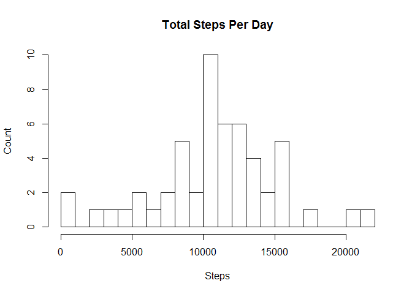
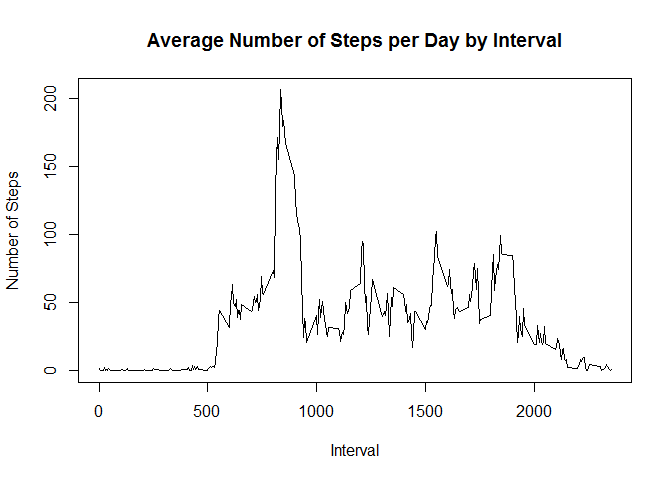
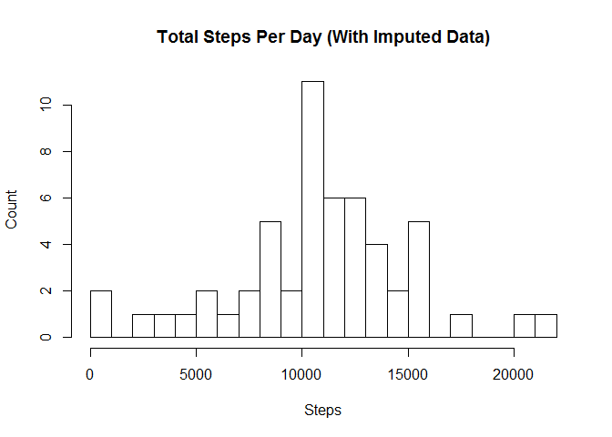
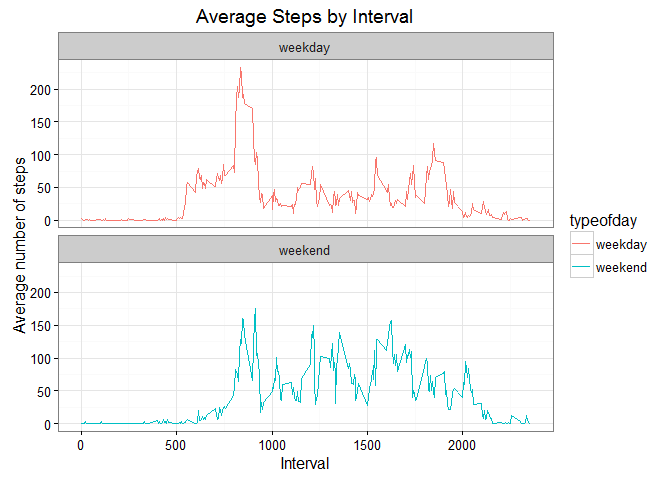

# Reproducible Research: Peer Assessment 1


## Loading and preprocessing the data

Make sure necessary libraries are available and loaded.


```r
if(!("knitr" %in% rownames(installed.packages()))) {
    install.packages("knitr")
}

library(knitr)
```

```
## Warning: package 'knitr' was built under R version 3.2.3
```

```r
if(!("ggplot2" %in% rownames(installed.packages()))) {
    install.packages("ggplot2")
}

library(ggplot2)
```

```
## Warning: package 'ggplot2' was built under R version 3.2.3
```

Set the defaults.


```r
opts_chunk$set(echo = TRUE)
```

The data file, `activity.zip`, is part of the repository. Unzip it and read the data.


```r
unzip("activity.zip")
sourcedata <- read.csv("activity.csv")
str(sourcedata)
```

```
## 'data.frame':	17568 obs. of  3 variables:
##  $ steps   : int  NA NA NA NA NA NA NA NA NA NA ...
##  $ date    : Factor w/ 61 levels "2012-10-01","2012-10-02",..: 1 1 1 1 1 1 1 1 1 1 ...
##  $ interval: int  0 5 10 15 20 25 30 35 40 45 ...
```


## What is mean total number of steps taken per day?

> For this part of the assignment, you can ignore the missing values in the dataset.
>
> 1. Make a histogram of the total number of steps taken each day
> 2. Calculate and report the **mean** and **median** total number of steps taken per day


```r
totalsteps <- aggregate(steps ~ date, sourcedata, sum)

hist(totalsteps$steps,
     xlab = "Steps",
     ylab = "Count",
     breaks = 20,
     main = "Total steps per day")
```

\

```r
originalmean <- round(mean(totalsteps$steps, na.rm = TRUE))
originalmedian <- median(totalsteps$steps, na.rm = TRUE)
originalmean
```

```
## [1] 10766
```

```r
originalmedian
```

```
## [1] 10765
```


## What is the average daily activity pattern?

> 1. Make a time series plot (i.e. `type = "l"`) of the 5-minute interval (x-axis) and the average number of steps taken, averaged across all days (y-axis)
> 2. Which 5-minute interval, on average across all the days in the dataset, contains the maximum number of steps?


```r
stepsbyinterval <- aggregate(steps ~ interval, sourcedata, mean)

plot(stepsbyinterval$interval,
    stepsbyinterval$steps,
    type = "l",
    xlab = "Interval",
    ylab = "Number of Steps",
    main = "Average Number of Steps per Day by Interval")
```

\

```r
maxrow <- stepsbyinterval[which.max(stepsbyinterval$steps), ]
maxinterval <- maxrow[1]
maxsteps <- maxrow[2]
paste(sep = "", "5-minute interval ", maxrow[1], " contains the maximum average number of steps (", floor(maxrow[2]), ") over the researched period.")
```

```
## [1] "5-minute interval 835 contains the maximum average number of steps (206) over the researched period."
```

## Imputing missing values

> Note that there are a number of days/intervals where there are missing values (coded as NA). The presence of missing days may introduce bias into some calculations or summaries of the data.
>
> 1. Calculate and report the total number of missing values in the dataset (i.e. the total number of rows with NAs)
> 2. Devise a strategy for filling in all of the missing values in the dataset. The strategy does not need to be sophisticated. For example, you could use the mean/median for that day, or the mean for that 5-minute interval, etc.
> 3. Create a new dataset that is equal to the original dataset but with the missing data filled in.
> 4. Make a histogram of the total number of steps taken each day and Calculate and report the mean and median total number of steps taken per day. Do these values differ from the estimates from the first part of the assignment? What is the impact of imputing missing data on the estimates of the total daily number of steps?

How many total missing values are in the dataset?


```r
sum(!complete.cases(sourcedata))
```

```
## [1] 2304
```

Get a feel of the missing data distribution, by date.


```r
incompletes <- aggregate(interval ~ date, sourcedata[!complete.cases(sourcedata), ], length)
incompletes$weekday <- weekdays(as.Date(incompletes$date,'%Y-%m-%d'))
names(incompletes) <- c("Date", "Count of incomplete rows", "Weekday")
incompletes
```

```
##         Date Count of incomplete rows   Weekday
## 1 2012-10-01                      288    Monday
## 2 2012-10-08                      288    Monday
## 3 2012-11-01                      288  Thursday
## 4 2012-11-04                      288    Sunday
## 5 2012-11-09                      288    Friday
## 6 2012-11-10                      288  Saturday
## 7 2012-11-14                      288 Wednesday
## 8 2012-11-30                      288    Friday
```

Seems like several days are missing all together. Since there's no strong pattern (e.g. missing weekends only), we'll fill mean values from corresponding intervals for each interval.


```r
means <- aggregate(steps ~ interval, sourcedata, mean)
means$steps <- round(means$steps)
augmenteddata <- sourcedata
missingsteps <- is.na(augmenteddata$steps)
augmenteddata$steps[missingsteps] <- means$steps[means$interval == augmenteddata$interval[missingsteps]]

totalsteps <- aggregate(steps ~ date, augmenteddata, sum)

hist(totalsteps$steps,
     xlab = "Steps",
     ylab = "Count",
     breaks = 20,
     main = "Total steps per day")
```

\

```r
newmean <- round(mean(totalsteps$steps, na.rm = TRUE))
newmedian <- median(totalsteps$steps, na.rm = TRUE)
paste("After imputing missing values, the mean is ", newmean, " (original mean is ", originalmean, "). Median is ", newmedian, " (original median is ", originalmedian, ").", sep = "")
```

```
## [1] "After imputing missing values, the mean is 10766 (original mean is 10766). Median is 10763.5 (original median is 10765)."
```

Since we were imputing with means, there is no impact on means, and the median became slightly lower.

## Are there differences in activity patterns between weekdays and weekends?

> For this part the `weekdays()` function may be of some help here. Use the dataset with the filled-in missing values for this part.
> 
> 1. Create a new factor variable in the dataset with two levels -- "weekday" and "weekend" indicating whether a given date is a weekday or weekend day.
> 2. Make a panel plot containing a time series plot (i.e. `type = "l"`) of the 5-minute interval (x-axis) and the average number of steps taken, averaged across all weekday days or weekend days (y-axis).


```r
augmenteddata$dow <- weekdays(as.Date(augmenteddata$date,'%Y-%m-%d'))
augmenteddata$typeofday <- as.factor(ifelse(augmenteddata$dow == "Saturday" |
                                 augmenteddata$dow == "Sunday", "weekend", "weekday"))

aggregated <- aggregate(steps ~ interval + typeofday, augmenteddata, mean)

plot1 <- ggplot(aggregated,
                aes(interval,
                    steps,
                    color = typeofday)) +
    geom_line() +
    facet_wrap(~typeofday, ncol = 1) +
    theme_bw() +
    labs(x = "Interval", y = "Average number of steps", title = "Average Steps by Interval")
print(plot1)
```

\

From the panel plot it is evident that during weekdays mornings have the most activity, followed by moderate increases between 4-7pm. The pattern is perhaps due to work commute and sports activities. During weekends, activity is more evently distributed during during the day.

